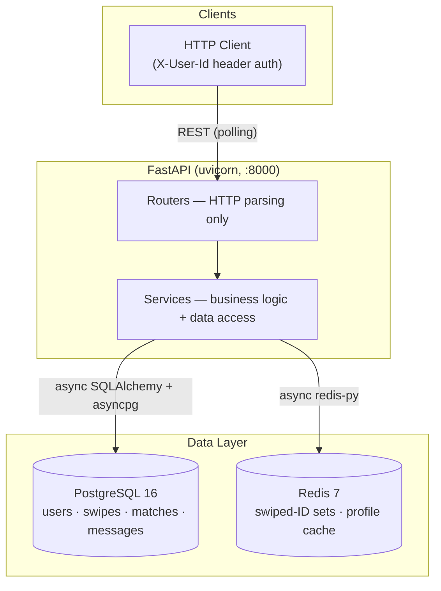
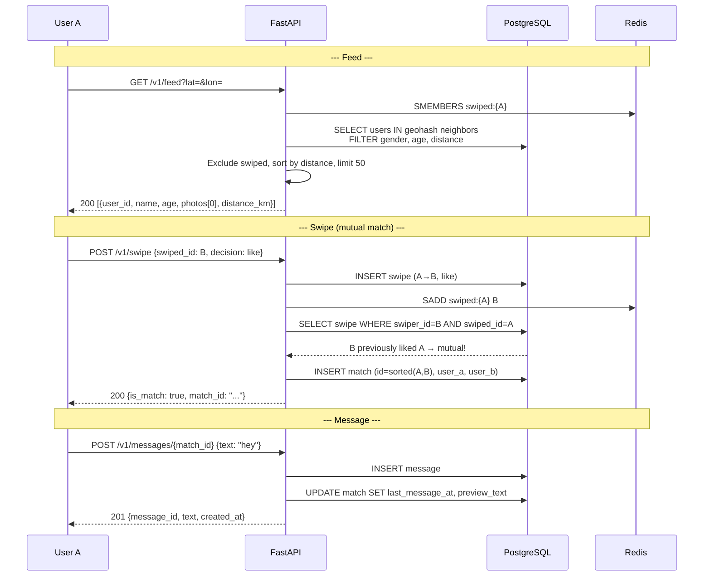

# Tinder MVP — Architecture & Design

## 1. Architecture overview



Single-process FastAPI application. PostgreSQL is the primary datastore; Redis provides fast feed exclusion (swiped-ID set) and optional profile caching. No WebSocket, no CDN, no separate ranking service.

### Core data flow: swipe → match → chat



## 2. Key architecture decisions

### D1: PostgreSQL (single-node) instead of Cassandra

PostgreSQL provides rich queries (JOINs, spatial), ACID guarantees, and single-node simplicity. Geohash-based queries with `WHERE geohash LIKE 'prefix%'` work for MVP volume. Cassandra's horizontal scale and append-heavy write optimization are unnecessary for an MVP serving thousands of users; ACID guarantees simplify match consistency — no reconciliation sweep needed.

### D2: Redis Set for swiped-ID tracking instead of Bloom filter

Redis Set (`swiped:{user_id}`) provides exact membership with zero false positives. Storage is negligible at MVP scale (~4 MB for 1,000 users × 1,000 swipes). A Bloom filter would require Redis Stack and introduces a 0.1% false-positive rate. At larger scale, migrate to Bloom filter.

### D3: Polling-only, no WebSockets

HTTP polling for match list and message inbox avoids WebSocket connection state, cross-instance routing (Redis PubSub), and reconnection logic. Match detection is synchronous at swipe time — no push notification infrastructure needed.

### D4: Distance-sorted feed, no ELO/ranking

Candidates sorted by Haversine distance, with `created_at DESC` tiebreaker. ELO scoring requires desirability tracking, cold-start handling, per-market weight tuning, and A/B testing infrastructure — all out of MVP scope.

### D5: Geohash spatial indexing via pygeohash

pygeohash provides encode/decode/neighbor calculation in a single Python-native call. 7-character geohash precision (~150 m × 150 m) used for candidate queries; neighbor cells (3×3 grid) expand the search area. Implementation is abstracted in `services/geohash.py` so the underlying library can be swapped.

### D6: Photos as URL strings, no CDN upload flow

`photos` column stores a JSON array of URL strings (max 9). No upload endpoint, no signed URLs, no image processing. URL strings let the MVP work with any image hosting without provisioning S3, IAM, or CDN.

## 3. Data model

### PostgreSQL tables

```sql
CREATE TABLE users (
    user_id     VARCHAR(26) PRIMARY KEY,        -- ULID, client-provided
    name        VARCHAR(100) NOT NULL,
    gender      VARCHAR(10) NOT NULL,            -- 'men' | 'women' | 'everyone'
    age         INTEGER NOT NULL CHECK (age >= 18),
    bio         TEXT DEFAULT '',
    photos      JSONB DEFAULT '[]',              -- up to 9 URL strings
    lat         DOUBLE PRECISION NOT NULL,
    lon         DOUBLE PRECISION NOT NULL,
    geohash     VARCHAR(12) NOT NULL,            -- 7-char, auto-computed from lat/lon
    preferences JSONB DEFAULT '{}',              -- {gender, age_min, age_max, radius_km}
    created_at  TIMESTAMPTZ DEFAULT now(),
    updated_at  TIMESTAMPTZ DEFAULT now()
);
CREATE INDEX idx_users_geohash ON users (geohash varchar_pattern_ops);
CREATE INDEX idx_users_gender_age ON users (gender, age);

CREATE TABLE swipes (
    swiper_id   VARCHAR(26) NOT NULL REFERENCES users(user_id),
    swiped_id   VARCHAR(26) NOT NULL REFERENCES users(user_id),
    decision    VARCHAR(4) NOT NULL,             -- 'like' | 'pass'
    created_at  TIMESTAMPTZ DEFAULT now(),
    PRIMARY KEY (swiper_id, swiped_id)
);
CREATE INDEX idx_swipes_swiped ON swipes (swiped_id, decision);

CREATE TABLE matches (
    match_id         VARCHAR(52) PRIMARY KEY,    -- concat(sort(user_a, user_b))
    user_a           VARCHAR(26) NOT NULL REFERENCES users(user_id),
    user_b           VARCHAR(26) NOT NULL REFERENCES users(user_id),
    is_active        BOOLEAN DEFAULT true,       -- false on unmatch
    last_message_at  TIMESTAMPTZ,
    preview_text     VARCHAR(100),               -- first 100 chars of last message
    created_at       TIMESTAMPTZ DEFAULT now()
);
CREATE INDEX idx_matches_user_a_active ON matches (user_a, is_active)
    WHERE is_active = true;
CREATE INDEX idx_matches_user_b_active ON matches (user_b, is_active)
    WHERE is_active = true;

CREATE TABLE messages (
    message_id  VARCHAR(26) PRIMARY KEY,         -- ULID, time-sortable
    match_id    VARCHAR(52) NOT NULL REFERENCES matches(match_id),
    sender_id   VARCHAR(26) NOT NULL REFERENCES users(user_id),
    text        TEXT NOT NULL,
    created_at  TIMESTAMPTZ DEFAULT now()
);
CREATE INDEX idx_messages_match_time ON messages (match_id, created_at DESC);
```

### Redis keys

| Key pattern | Type | Purpose | TTL |
|---|---|---|---|
| `swiped:{user_id}` | Set | Swiped profile IDs for feed exclusion | Persistent (pruned by age) |
| `profile:{user_id}` | Hash | Cached profile fields for feed assembly | 300 s |

## 4. API contracts

All endpoints under `/v1`. Authenticated via `X-User-Id` header (ULID string, client-provided).

### `POST /v1/profile/me` — Create or update profile (FR-1, FR-2)

```
Request:
  Header:  X-User-Id: <user_id>
  Body: {
    "name": "Alice",
    "gender": "women",              // "men" | "women" | "everyone"
    "age": 25,
    "bio": "...",
    "photos": ["https://..."],      // max 9 URLs
    "lat": 40.7128,
    "lon": -74.0060,
    "preferences": {                // optional
      "gender": "men",
      "age_min": 22,
      "age_max": 35,
      "radius_km": 25               // clamped [1, 160] silently
    }
  }

Response 201: full profile with computed geohash, created_at, updated_at
Response 422: age < 18, invalid gender, too many photos, radius out of range
```

Upsert semantics: creates if `user_id` is new, updates if it exists. Geohash auto-computed from lat/lon on write.

### `GET /v1/profile/me` — Read own profile

```
Response 200: full profile; Response 404: profile not found
```

### `GET /v1/feed?lat=&lon=` — Candidate discovery (FR-3)

```
Request:
  Header:  X-User-Id: <user_id>
  Query:   lat=40.7128&lon=-74.0060&limit=50   // limit 1-100, default 50

Response 200:
  {
    "candidates": [
      {
        "user_id": "01J...",
        "name": "Bob",
        "age": 28,
        "photos": ["https://..."],      // first photo only
        "distance_km": 2.3
      }
    ]
  }
```

Algorithm: compute geohash → query neighboring cells → filter by preferences (gender, age, radius) → exclude swiped and matched users → sort by Haversine distance, then `created_at DESC` → limit 50.

### `POST /v1/swipe` — Record swipe, detect match (FR-4)

```
Request:
  Header:  X-User-Id: <swiper_id>
  Body:    {"swiped_id": "01J...", "decision": "like"}   // "like" | "pass"

Response 200 (no match):    {"is_match": false, "match_id": null}
Response 200 (mutual):      {"is_match": true, "match_id": "01J...01J..."}
Response 200 (idempotent):  same as first swipe result
Response 409:               {"detail": "Already matched: ..."}
Response 422:               self-swipe, invalid decision
```

Idempotent via `ON CONFLICT (swiper_id, swiped_id) DO NOTHING`. Mutual match detection: after writing swipe, checks inverse swipe. Match creation uses sorted ULID pair as match_id with `ON CONFLICT DO NOTHING` for race safety.

### `GET /v1/matches` — List active matches (FR-5)

```
Request:
  Header:  X-User-Id: <user_id>
  Query:   before=<match_id>&limit=20    // cursor pagination

Response 200:
  {
    "matches": [
      {
        "match_id": "01J...01J...",
        "other_user": {"id": "01J...", "name": "Bob", "photos": ["https://..."]},
        "last_message_at": "2026-...",
        "preview_text": "Hey, how's it..."       // null if no messages
      }
    ],
    "next_cursor": "01J...01J..."                // null if last page
  }
```

Sorted by `last_message_at DESC`, then `created_at DESC`. `other_user` resolves to the non-requesting participant.

### `POST /v1/messages/{match_id}` — Send message (FR-6)

```
Request:
  Header:  X-User-Id: <sender_id>
  Body:    {"text": "Hey!"}

Response 201: {message_id, match_id, sender_id, text, created_at}
Response 403: not a match participant
Response 404: match not found or inactive
```

On send: inserts message row, updates `match.last_message_at` and `match.preview_text`.

### `GET /v1/messages/{match_id}?before=<cursor>` — Message history (FR-6)

```
Response 200:
  {
    "messages": [
      {"message_id": "01J...", "sender_id": "01J...", "text": "...", "created_at": "..."}
    ],
    "next_cursor": "01J..."                // null if last page
  }

Response 403: not a match participant
Response 404: match not found
```

Cursor-paginated (ULID-based), 20 per page, reverse chronological (newest first).

### `DELETE /v1/matches/{match_id}` — Unmatch (FR-7)

```
Response 200: {"unmatched": true}
Response 403: not a match participant
Response 404: match not found
```

Soft delete: sets `is_active = false`. Match vanishes from `GET /v1/matches`. Messages remain readable but new messages are blocked.

### `GET /healthz` — Health check (FR-8)

```
Response 200: {"status": "ok"}
```

## 5. Module layout

```
src/tinder/
├── main.py         — app factory, lifespan (DB connection check), router mounting
├── config.py       — pydantic-settings: DATABASE_URL, REDIS_URL, APP_PORT, HOST, LOG_LEVEL
├── database.py     — async engine + session factory + get_db dependency
├── models/         — SQLAlchemy ORM: User, Swipe, Match, Message
├── schemas/        — Pydantic: ProfileCreate/Response, FeedResponse, SwipeRequest/Response, MatchItem/Response, MessageSend/Response
├── routers/        — thin HTTP layer: profile, feed, swipe, matches, messages
└── services/       — business logic: profile, feed, swipe, match, message, geohash, redis_client
```

**Layering rules:** routers parse HTTP and call services. Services contain all business logic and data access. Models are ORM declarations only. Schemas are Pydantic request/response shapes.

## 6. FR → acceptance test map

| FR | Acceptance test file | Key assertions |
|---|---|---|
| FR-1 | `test_fr1_create_edit_profile.py` | `POST /v1/profile/me` → 201 with full profile; repeat upserts; age < 18 → 422; invalid gender → 422 |
| FR-2 | `test_fr2_discovery_preferences.py` | Preferences stored and returned; radius clamped 1–160; out-of-range → 422 |
| FR-3 | `test_fr3_feed.py` | Candidates sorted by distance; preferences filtered; no self; no previously-swiped |
| FR-4 | `test_fr4_swipe.py` | Like without reciprocal → `{is_match: false}`; mutual → `{is_match: true, match_id}`; idempotent; 409 on matched |
| FR-5 | `test_fr5_match_list.py` | Paginated matches; includes match from FR-4; `other_user` is correct participant |
| FR-6 | `test_fr6_messaging.py` | Send → 201; GET → paginated, reverse-chronological; non-participant → 403 |
| FR-7 | `test_fr7_unmatch.py` | Unmatch → 200 `{unmatched: true}`; match removed from list; non-participant → 403 |
| FR-8 | `test_fr8_health.py` | `GET /healthz` → 200 `{"status": "ok"}` |

Each acceptance test is a black-box HTTP test (`httpx.AsyncClient` + `ASGITransport`) that asserts real input-to-output against the running system. The suite runs via `API_BASE_URL=http://localhost:${APP_PORT} pytest verify/acceptance/ -v`, producing 44 passing assertions.

## 7. Test results — SPEC §6 scenarios

The SPEC defines six scenario categories. Each maps to tests in `tests/functional/test_scenarios.py` (white-box, 17 test cases) and is covered by the acceptance suite:

| SPEC §6 scenario | Functional test | Description |
|---|---|---|
| **Idempotency** | `test_profile_upsert_is_idempotent` | Profile upsert via `POST /v1/profile/me` returns same `created_at` on repeat call |
| **Idempotency** | `test_swipe_twice_idempotent` | Swiping the same profile twice: second call returns same `is_match` result |
| **Idempotency** | `test_unmatch_is_idempotent` | Unmatching an already-unmatched match returns 200 or 404 |
| **Ordering** | `test_messages_reverse_chronological` | Three messages returned newest-first (Third, Second, First) |
| **Pagination** | `test_message_cursor_pagination` | `before` cursor yields disjoint pages; pagination exhausts correctly |
| **Pagination** | `test_match_list_cursor_pagination` | `GET /v1/matches?limit=3` returns 3 with `next_cursor` for 5-match user |
| **Ownership** | `test_non_participant_cannot_send_message` | Outsider gets 403 on `POST /v1/messages/{match_id}` |
| **Ownership** | `test_non_participant_cannot_read_messages` | Outsider gets 403 on `GET /v1/messages/{match_id}` |
| **Ownership** | `test_non_participant_cannot_unmatch` | Outsider gets 403 on `DELETE /v1/matches/{match_id}` |
| **Validation** | `test_age_below_18_rejected` | Age 17 → 422 |
| **Validation** | `test_radius_out_of_range_clamped` | radius_km 200 → clamped to 160, returns 201 |
| **Validation** | `test_radius_below_1_clamped` | radius_km 0 → clamped to 1, returns 201 |
| **Validation** | `test_duplicate_swipe_on_matched_returns_409` | Swiping an already-matched user → 409 |
| **Validation** | `test_self_swipe_rejected` | Swiping own profile → 422 |
| **Cross-entity** | `test_unmatch_removes_from_list` | After unmatch, match ID absent from `GET /v1/matches` |
| **Cross-entity** | `test_match_creation_links_swipe_and_match` | Mutual like creates match visible in both users' match lists |

These 17 scenario tests run embedded against the ASGI app (white-box via `AsyncClient(transport=ASGITransport(app=...))`) and require PostgreSQL. In CI (`.github/workflows/functional.yml`), they run against a Postgres service container after `alembic upgrade head`.

## 8. CI/CD

Three GitHub Actions workflows run on push, pull request, and daily cron:

| Workflow | File | What it does |
|---|---|---|
| **Lint** | `.github/workflows/lint.yml` | `ruff check` with version `0.8.0` |
| **CI** | `.github/workflows/ci.yml` | `unit` job (`pytest tests/unit/`) + `e2e` job (sources `verify/manifest.env`) |
| **Functional** | `.github/workflows/functional.yml` | Postgres service → `alembic upgrade head` → `pytest tests/functional/ -v` |
