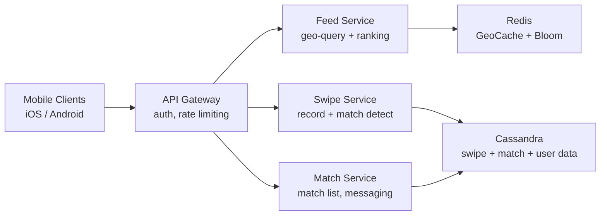
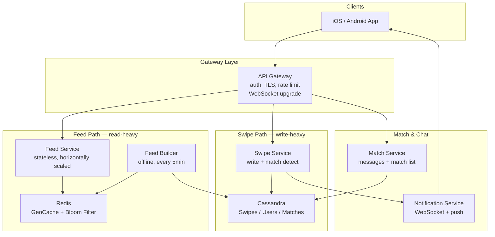

# System Design: Tinder

## 1. Problem frame

Tinder is a mobile dating app where users create profiles, set discovery preferences, and swipe through a stack of nearby profiles — right to like, left to pass. When two users mutually like each other, a match is formed and they can message. With 75M+ MAU and 2B+ swipes/day, the system must serve geo-partitioned feeds at low latency, detect mutual matches in real time, and scale to millions of concurrent users.



## 2. Requirements

### Functional

- **FR1:** Create and edit a dating profile with photos, bio, gender, and age
- **FR2:** Set discovery preferences — gender, age range, and distance radius
- **FR3:** View a stack of nearby profiles and swipe right (like) or left (pass)
- **FR4:** Receive instant notification when a mutual match is formed
- **FR5:** Send and receive messages with matched users
- **FR6:** Unmatch or report a user from the match list

### Non-functional

- **NFR1:** Swipe-to-match detection under 200ms p95
- **NFR2:** Feed of candidate profiles loads in under 500ms including geo-query and rank
- **NFR3:** 99.9% availability on the swipe write path
- **NFR4:** Scale to 2B swipes/day (23K avg QPS, 50K peak) with geo-partitioned workloads

Out of scope: photo moderation, real-time location tracking, subscription tiers, social-auth, analytics platform.

## 3. Back of the envelope

20M DAU × 100 swipes/user/day → 2B swipes/day ≈ 23K QPS avg, 50K QPS peak. Each swipe ~200 bytes → 400 GB raw/day, 12 TB/month. 

2B swipes × ~3% match rate → ~60M mutual likes/day, ~26M matches/day after deduplication. Match detection at swipe time via single-partition read on swiped user's partition.

10K active users per geo-zone (radius ~50km) × 50 bytes/profile → ~500 KB candidate data per zone. Pre-computed feed buckets per geo-zone refreshed every 5 min. 1M geo-zones worldwide.

## 4. Entities & API

```
User
  user_id: string (PK)
  name: string
  gender: string (INDEX)           ← drives discovery filter
  age: integer (INDEX)             ← drives discovery filter
  bio: string
  photos: string[]                  ← CDN URLs, up to 9
  location: geo                     ← geohash-encoded
  preferences: json                 ← {gender, age_min, age_max, radius_km}
  created_at: timestamp
  last_active: timestamp

Swipe
  swiper_id: string (PK)
  swiped_id: string (CK)
  decision: string                  ← 'like' | 'pass'
  timestamp: timestamp (CK desc)
  swiper_geohash: string

Match
  match_id: string (PK)             ← sorted pair: concat(smaller, larger)
  user_a: string
  user_b: string
  is_active: boolean
  last_message_at: timestamp
  preview_text: string
  created_at: timestamp

Message
  match_id: string (PK)
  message_id: ulid (CK desc)
  sender_id: string
  text: string
  created_at: timestamp
```

### API

- `GET /v1/feed?lat=…&lon=…` — candidate profiles for the requesting user; returns up to 50 profiles (id, name, age, photos[0], distance) filtered by preferences and excluding previously-swiped users
- `POST /v1/swipe` — record a swipe; body: `{swiped_id, decision, lat, lon}`; returns `{is_match: bool, match_id: string|null}`
- `GET /v1/matches` — paginated list of active matches with last message preview
- `GET /v1/messages/{match_id}?before=<cursor>` — cursor-based paginated message history
- `POST /v1/messages/{match_id}` — send a message; body: `{text}`
- `POST /v1/profile/me` — create or update profile; body: `{name, gender, age, bio, photos, preferences, lat, lon}`
- `DELETE /v1/matches/{match_id}` — unmatch

## 5. High-Level Design



### FR1: Create and edit a dating profile

Client → API Gateway → User Service → Cassandra (User table) → CDN (photo storage). Photo uploads use signed-URL pattern: User Service generates a time-limited PUT URL, client uploads directly to CDN. Profile upsert via `POST /v1/profile/me` with idempotent overwrite on `user_id`.

### FR2: Set discovery preferences

Stored as JSON blob on the User row. Preferences take effect on next feed refresh — no active invalidation. Validated: radius 1–160 km, age_min ≥ 18 and ≤ age_max.

### FR3: Feed + Swipe (DD1/DD2/DD3 deep dives below)

Feed: `GET /v1/feed` computes 6-char geohash → Redis `zone:{geohash6}` (pre-computed candidate sorted set) → Bloom filter exclusion → preference filter → top 50 returned with scoring.

Swipe: Write-then-check with same-partition atomic read (Approach 4). Write swipe to Cassandra → read inverse swipe on same partition → if mutual like, write match idempotently. Race-safe with idempotent match_id key.

### FR4: Match notification

WebSocket for online users (sub-50ms delivery), APNs/FCM push for offline. Connection registry backed by Redis for cross-instance routing. Push retry with exponential backoff, 5-min TTL.

### FR5: Messaging

Cassandra with `match_id` partition key, ULID message_id clustering (time-sorted). Messages co-located per conversation. Denormalized `last_message_at` + `preview_text` on match row. Cursor-based pagination, 20 per page, reverse chronological.

### FR6: Unmatch/Report

Soft delete: `is_active = false` on match row. Reports go to dedicated reports table with 3-report/7-day auto-flag threshold → temporary feed suspension → moderation queue.

## 6. Deep Dives

### DD1: Swipe consistency and match-at-scale

**Decision: Approach 4** — Write-then-check with same-partition atomic read and idempotent match creation.

The coordinator writes swipe(A→B) to Cassandra, then reads swipe(B→A) on B's partition. If B's swipe is a like → write match with idempotent key `concat(sort(A,B))`. Race scenario: two coordinators handling concurrent mutual likes both detect the match; the duplicate match write is harmless (IF NOT EXISTS or idempotent key). Worst case: coordinator crashes after write but before read — reconciliation sweep recovers.

### DD2: Feed generation and geo-spatial indexing

**Decision: Approach 2** — GeoHash-based pre-computed candidate buckets with Redis sorted sets, refreshed every 5 min.

6-character geohash → ~1.2km × 0.6km rectangles. Offline Feed Builder job runs every 5 min per geo-zone, queries active users in zone + 8 neighbors (3×3 grid), stores top 500 by desirability score in Redis Sorted Set with 5-min TTL. Read path: O(1) Redis lookup + in-memory filter pass. Sparse areas fall back to 5×5 grid expansion.

### DD3: Avoiding re-shown profiles

**Decision: Approach 3** — Bloom filter with 0.1% false-positive rate, 18 KB per user for 10K swipes, stored in Redis Stack.

m = 144,000 bits ≈ 18 KB for 10K swipes at 0.1% FPR, k ≈ 10 hash functions. Sub-millisecond membership check. Weekly rebuild from Cassandra to keep FPR at target. 20M DAU × 18 KB = 360 GB total — fits 3–4 Redis nodes.

### DD4: Recommendation ranking

**Decision: Approach 2** (multi-factor scoring) as baseline, Approach 3 (collaborative filtering) as gradual rollout.

Score = w₁×desirability_elo + w₂×profile_completeness + w₃×activity_recency + w₄×new_user_boost + w₅×mutual_interest + w₆×diversity_penalty. Weights A/B tested per market. Cold-start: 2.0× boost for 48h + median desirability score. Inactive decay: 7-day stale users get 0.1× activity multiplier.

## 7. Trade-offs

| Decision | Option A | Option B | Chosen | Why |
|---|---|---|---|---|
| Match consistency | Distributed transaction | Write-then-check | Write-then-check | Stateless coordinators, no cross-partition locks, recovery via reconciliation |
| Geo-index | PostGIS spatial query | Geohash + Redis pre-compute | Geohash + Redis | O(1) read path, 5-min staleness acceptable |
| Swiped exclusion | DB NOT IN query | Bloom filter | Bloom filter | 18 KB/user, 0.1% FPR acceptable for dating |
| Ranking | ELO only | Multi-factor + CF | Multi-factor (CF later) | Transparent, tunable, no cold-start problem |
| Datastore | PostgreSQL | Cassandra | Cassandra | Append-heavy swipe writes, known partition keys, geo-distribution |

## 8. References

- Tinder Engineering Blog: The Tinder Tech Stack
- InfoQ: How Tinder Delivers Real-Time Experiences at Scale
- HelloInterview System Design Article — Tinder
- Geohash: Encoding Geographic Locations
- Redis Stack: Bloom Filter Data Type
- Kleppmann: Designing Data-Intive Applications, Chapter 7
- Cassandra Documentation: Lightweight Transactions
- Covington et al.: Deep Neural Networks for YouTube Recommendations
